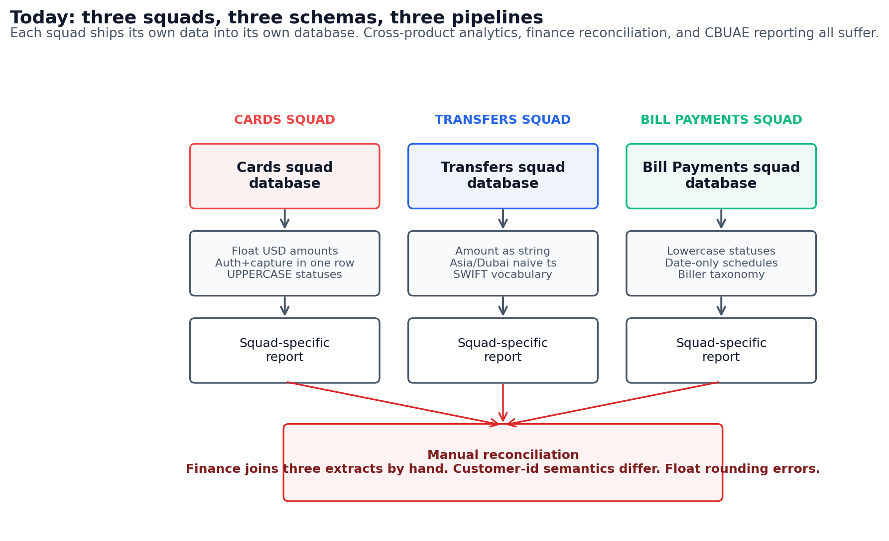
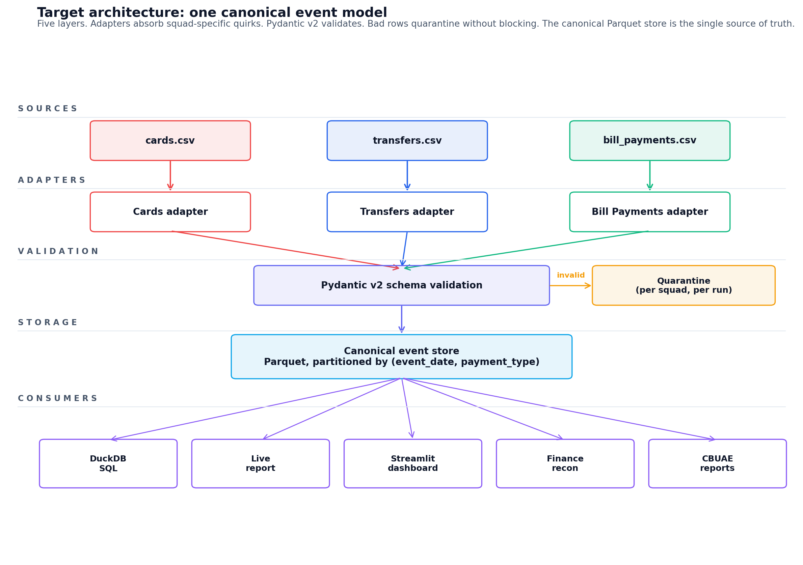
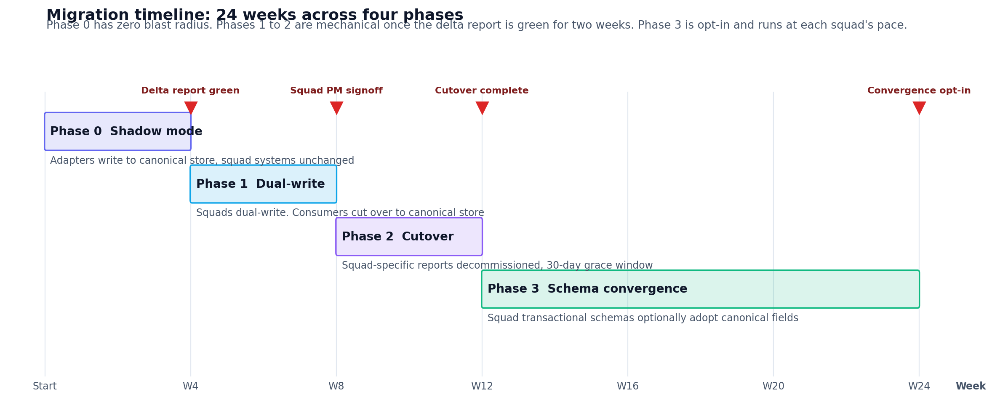

## Executive summary {-}

Mal has three product squads (Cards, Transfers, Bill Payments) shipping payment events into three different schemas, three different databases, and three different sets of squad-specific reports. Cross-product analytics, finance reconciliation, and CBUAE regulatory reporting all suffer. Float rounding errors in the Cards squad have already caused two known reconciliation incidents.

This paper proposes a single canonical event model, a quarantine-pattern validation layer, and a four-phase migration that lands each squad on the new model with zero blast radius in Phase 0 and a mechanical cutover by Phase 2. Deliverable 1 is a working implementation in 449 lines of Python with 24 tests passing. Deliverable 3 is a Streamlit data-quality dashboard on top of the canonical store.

The single biggest risk is adoption, not technology. Phase 0 (shadow mode) is what de-risks it. The canonical model handles each squad's reality without any squad changing anything until they choose to.

::: {.callout-note appearance="minimal" icon=false}
**At a glance.** One canonical event model. Quarantine validation. Integer minor units. Five load-bearing design decisions. Twenty-four week migration in four phases. Ten production gaps cut from D1, half of them non-negotiable for production launch.
:::

## Context and stakeholders

Mal is a UAE-based neobank with Islamic banking products. Three product squads own three payment surfaces:

- **Cards.** Debit and credit card transactions. Auth and capture lifecycle, decline-code vocabulary, MCC-tagged merchants, mostly AED with some USD and GBP.
- **Transfers.** Domestic and international wires, P2P, and remittance corridors. UAE to India, Philippines, Pakistan, Bangladesh, and Egypt are real expat-driven flows. SWIFT-flavored vocabulary and Asia/Dubai timestamps.
- **Bill Payments.** Utilities, telecom, government, and insurance billers. Scheduled vs executed lifecycle. Lowercase status vocabulary. AED only.

Each squad ships data into its own database. The pain shows up in four places.

| Stakeholder | Pain today |
|---|---|
| Finance reconciliation | Three pipelines, manual joins, float rounding incidents in Cards |
| Customer Success | No cross-product customer view. The customer-id field is a string two squads happen to use the same way |
| Compliance and CBUAE reporting | Corridor-level remittance volume sits in Transfers; failure-code vocabulary differs from Cards; no shared audit trail |
| Platform reliability | No single dashboard for "all payment failures last 7 days" because each squad has its own status vocabulary |

## Target architecture

The canonical event model has five layers and one canonical Parquet store. Adapters absorb squad-specific quirks at the boundary. Pydantic v2 validates every row. Bad rows quarantine without blocking the batch. The canonical store is the single source of truth for all downstream consumers.

### Five load-bearing design decisions

Each is a direct response to a real failure mode in the current state.

**1. Event-grain, not payment-grain.** A card transaction is "auth" plus "capture" plus possibly "refund". The Cards squad models this as one row with two timestamps. The Bill Payments squad models it as one row with a single status field. Neither approach extends to lifecycle queries across products. The canonical model keeps each event as its own row and links them via `correlation_id`. The auth-to-settle latency query in D1 (SQL 03, p50/p95/p99 across captures) cannot be written cleanly on the squad-grained data.

**2. Integer minor units.** Cards stores `auth_amount_usd` as a float. Two known reconciliation incidents have already been traced to floating-point error. The canonical schema stores `amount_minor` as an integer in the smallest currency unit, parsed at the squad boundary using `decimal.Decimal` with banker's rounding (ROUND_HALF_EVEN). The v1 to v2 migration in `schema/migrations.py` is the recovery path for v1 data already in flight.

**3. raw_payload preserved per row.** Adoption is the hardest part of any platform play. Squads will resist if they think they lose information by handing data over. Every canonical row carries the full original payload as JSON. The squad does not lose anything; the platform earns trust; auditability is automatic.

**4. payment_method_details as a JSON bag.** When the Wallet squad ships in Q3, we add an adapter, not a schema migration. The strict canonical fields cover identity, amount, status, parties. Anything squad-specific lives in a JSON bag. This bounds the cost of new payment types to one adapter file.

**5. Quarantine, not fail-fast validation.** Validation produces (valid, invalid) batches. Bad rows from Cards do not block the day's Transfers ingest. Quarantine files carry the original payload plus the Pydantic or `AdapterParseError` reason, and live under `data/output/quarantine/{run_ts}/{squad}.json`. Pipeline exit code stays zero even with quarantined records; non-zero exit is reserved for infrastructure failures.

::: {.callout-tip appearance="simple" icon=false}
**Why this set of five.** Decisions 1 and 2 fix concrete reconciliation incidents. Decisions 3 and 4 are the adoption levers; they make the platform something squads want to use, not a tax. Decision 5 is the cross-team-collaboration signal: a single bad row from one squad never blocks another.
:::

## Migration strategy

Three years of squad-specific data, three squad PMs with their own roadmaps, and downstream consumers already wired into squad-specific tables. The migration runs in four phases.

### Phase 0, shadow mode (weeks 1 to 4)

The adapter for each squad reads from the squad's existing database (or daily CSV export) and writes to the canonical store. Squad systems remain unchanged. Daily delta report compares row counts and amounts.

- **Goal.** Prove the canonical model handles each squad's reality, including the messy edges (the "AED twelve fifty" amount strings, the lowercase bill statuses, the Asia/Dubai naive timestamps that D1's mock data deliberately reproduces).
- **Exit criterion.** Delta report green for two consecutive weeks. Squad PM reviews and signs off.
- **Risk.** Adapter misses a squad-specific edge case and silently drops or mistransforms rows. **Mitigation.** Quarantine pattern catches schema breaches; the daily delta report catches semantic drift.

### Phase 1, dual-write (weeks 5 to 8)

The squad writes into the canonical store via the adapter in addition to its own database. Downstream consumers (Finance, Customer Success) start reading from the canonical store. Squad-specific dashboards keep working.

- **Goal.** Move the read path. Failure-code vocabularies are normalized at this stage; squad PMs sign off on the mappings (DECLINED 51 maps to "Insufficient funds" and so on).
- **Exit criterion.** Two consecutive weeks of zero blockers. Finance and Customer Success accept the canonical store as their primary source.
- **Risk.** Vocabulary mapping disputes between squads. **Mitigation.** Mapping is owned by the platform team but signed off per-squad; disputes escalate to one Director.

### Phase 2, cutover (weeks 9 to 12)

Squad-specific reporting moves to the canonical store. The squad keeps writing to its own transactional database; the canonical store is the analytics source of truth. Old per-squad reports are decommissioned with a 30-day grace window.

- **Goal.** Retire squad-specific reporting infrastructure.
- **Exit criterion.** Old dashboards offline. CBUAE reports running off the canonical store.
- **Risk.** A consumer misses the cutover and reads stale squad data. **Mitigation.** The 30-day grace window keeps both alive; squad-specific reports show a banner pointing at the canonical replacement.

### Phase 3, schema convergence (weeks 13 to 24)

Where the squad PM agrees, the squad's transactional schema starts moving toward the canonical fields. The amount-as-string in Transfers, the float USD in Cards, and the LOWERCASE statuses in Bill Payments are all candidates. Opt-in, not blocking.

- **Goal.** Reduce the load on the adapter layer over time.
- **Exit criterion.** Each squad signs off independently. The platform does not block on it.
- **Risk.** Squad PMs deprioritize convergence indefinitely. **Mitigation.** The platform works regardless. Convergence is a "nice to have", not a "must have".

### Schema versioning protocol

The v1 to v2 schema migration in D1 is the template for any future schema bump.

- New required field gets a default that makes sense for legacy rows.
- Banker's rounding handles numerical conversion.
- Every output row is re-validated against the new schema before write.
- Source data is never mutated.
- The migration is idempotent. Re-running it is safe.

## Production readiness

D1 is scoped for a 30-second local run. At Mal's expected production volume of around 100K transactions per day across all three squads, the following gaps matter.

### Gap punch list

| Gap | What D1 does | What production needs | Priority |
|---|---|---|---|
| Orchestration | One Python process | Dagster (asset-based, SQL sensors, lineage UI) | High |
| Ingestion | CSV files in `data/raw/` | Debezium and Kafka for CDC, 30-second freshness SLO | High |
| Customer identity | `customer_id` string trusted from each squad | Identity service deduplicating across phone, email, national ID | High |
| PII tokenization | last4 only; no real PII in mocks | Vault or KMS for tokens; analytics never sees raw PII | High |
| Observability | One INFO line per squad per run | Structured logging, per-stage metrics, alerts on quarantine spikes | High |
| Schema registry | Pydantic models in the repo | Confluent Schema Registry or Git-based registry with evolution rules | Medium |
| Multi-region DR | Single local Parquet directory | UAE-resident primary, second region for DR, CBUAE residency rules | Medium |
| Backfill and replay | Re-run `make seed` and `make run` | Replay-from-Kafka with idempotent writes; backfill jobs in Dagster | Medium |
| Dashboards | Static GitHub Pages report and Streamlit (D3) | Looker or Superset on the canonical store, with squad-specific saved views | Medium |
| FX rates | Hardcoded USD, AED, GBP | Price-service integration with timestamped rates and audit trail | Medium |

The High items are non-negotiable for a production launch. The Medium items can land iteratively after the canonical store is live. None of them change the canonical model.

### Why Dagster over Airflow

Airflow's DAG model treats every step as a task. Dagster treats data assets as first-class, with SQL and Python sensors that fire when an upstream asset changes. For a payment platform that has to reconcile across three squads, an asset-based model maps directly to "the canonical event store for date X is fresh". Airflow can do this with sensors and XComs but the wiring is brittle. Dagster's lineage UI also gives finance and compliance a way to trace where any given canonical row came from, which is a real CBUAE-audit ask.

### Why CDC over nightly extracts

Nightly extracts are fine for monthly finance reporting. They are not fine for fraud monitoring, real-time customer-360, or platform reliability dashboards that should surface "bill payment failures spiking right now". CDC via Debezium gives a 30-second freshness SLO, supports replay (which we will need on day one for backfills), and avoids the daily-batch-window problem that gets worse as squad volume grows.

## Risk register

The five risks worth calling out explicitly.

| Risk | Likelihood | Impact | Mitigation |
|---|---|---|---|
| Squad PM deprioritizes Phase 0 onboarding | Medium | High | Phase 0 has zero blast radius; squad does no work; we run the adapter against their export |
| Vocabulary mapping disputes between squads | Medium | Medium | Mapping owned by platform team; disputes escalate to one Director |
| Customer identity collisions across squads | High | High | Out of scope for D1. Identity service is a Phase 1 dependency, not a Phase 0 blocker |
| CBUAE residency requirements bite mid-rollout | Low | High | Pick UAE-resident object store from day one. DR region is design-time, not retrofit |
| Adapter coverage gap in production | Medium | Medium | Quarantine pattern catches it; daily quarantine-rate alert on the D3 dashboard catches the spike |

## Success metrics

The platform earns its keep on three axes.

**Adoption (lagging).** Number of squads onboarded; share of consumer queries hitting the canonical store; share of squad-specific reports decommissioned. Target by week 12: three squads onboarded, 100% of finance reconciliation on canonical, 80% of squad reports retired.

**Quality (leading).** Quarantine rate per squad (target under 2%); schema-drift incidents per quarter (target zero unannounced); reconciliation deltas between squad source and canonical (target under 0.01% by row count, exact by amount).

**Performance (operational).** Ingestion freshness SLO (30 seconds, p95); pipeline run time (under 10 minutes for daily backfill at 100K transactions); availability (99.9% monthly).

D3's data-quality dashboard surfaces the leading-quality metrics in real time. Finance and Customer Success own the lagging adoption metrics; platform reliability owns the operational performance metrics.

## Closing

D1 proves the canonical model and the quarantine pattern. D2 puts a four-phase migration plan, a production-gap punch list, a risk register, and a success-metric framework against it. D3 gives platform reliability the per-squad ingestion-rate, quarantine-rate, and schema-drift signals it needs to operate this in production.

The single biggest risk is adoption, not technology. Phase 0 is what proves the canonical model handles each squad's reality without any squad changing anything. Once that delta report is green for two weeks, dual-write and cutover are mechanical. Phase 3 is the bonus, not the goal. The goal is one canonical event store that Finance, Customer Success, Compliance, and Platform reliability can all rely on.
